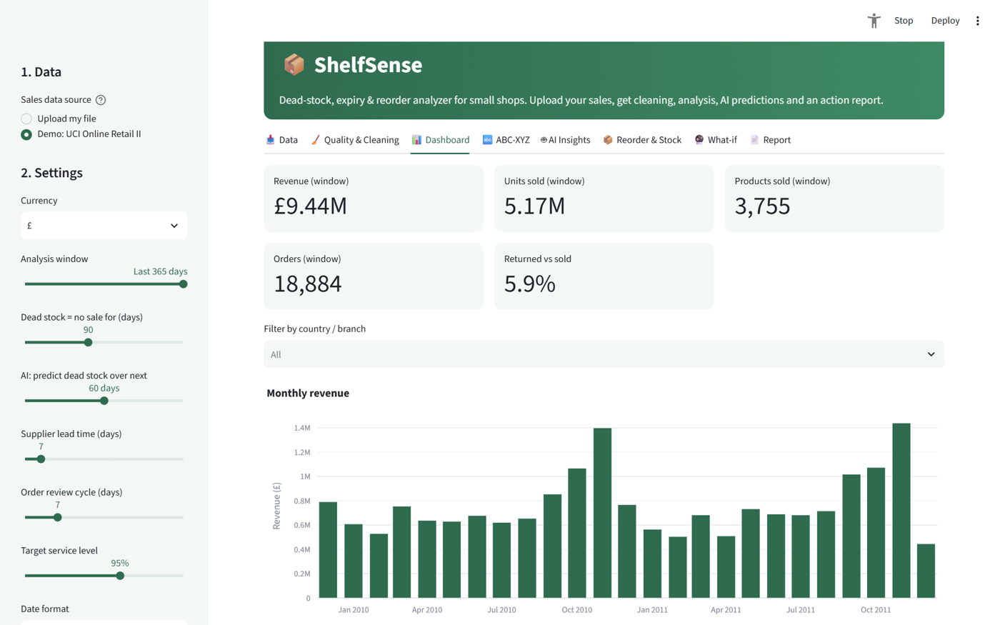
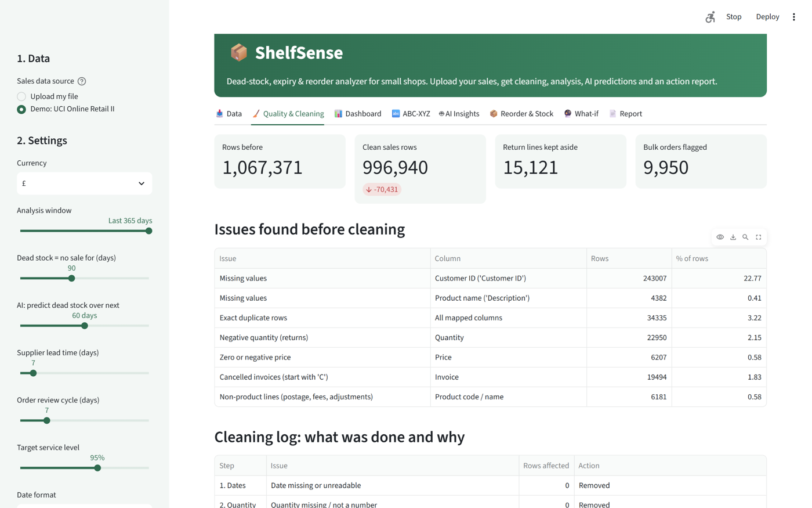
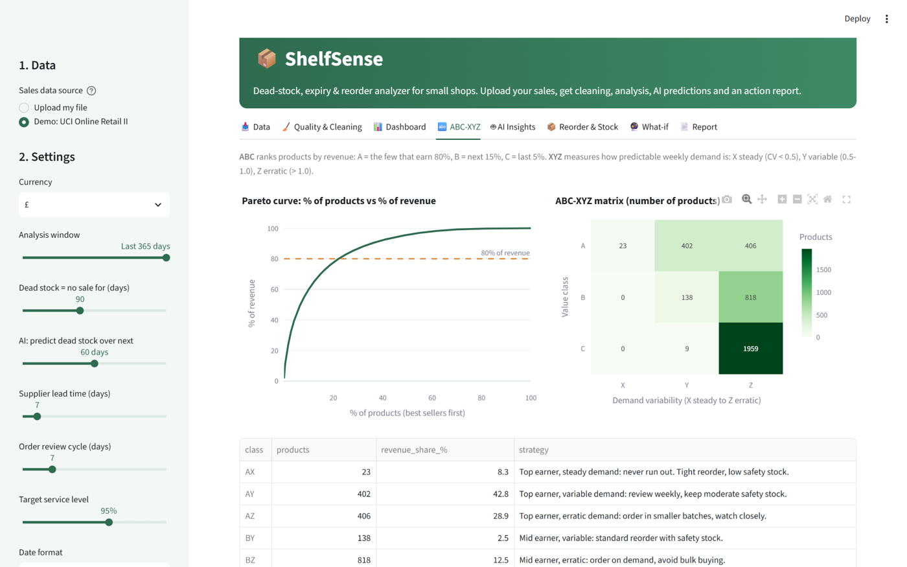
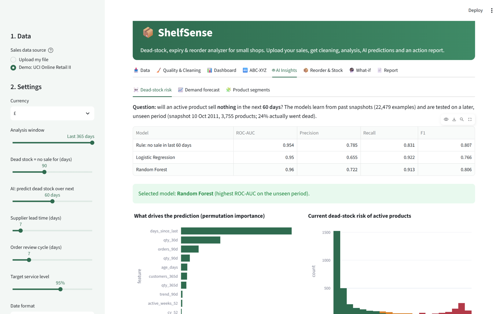
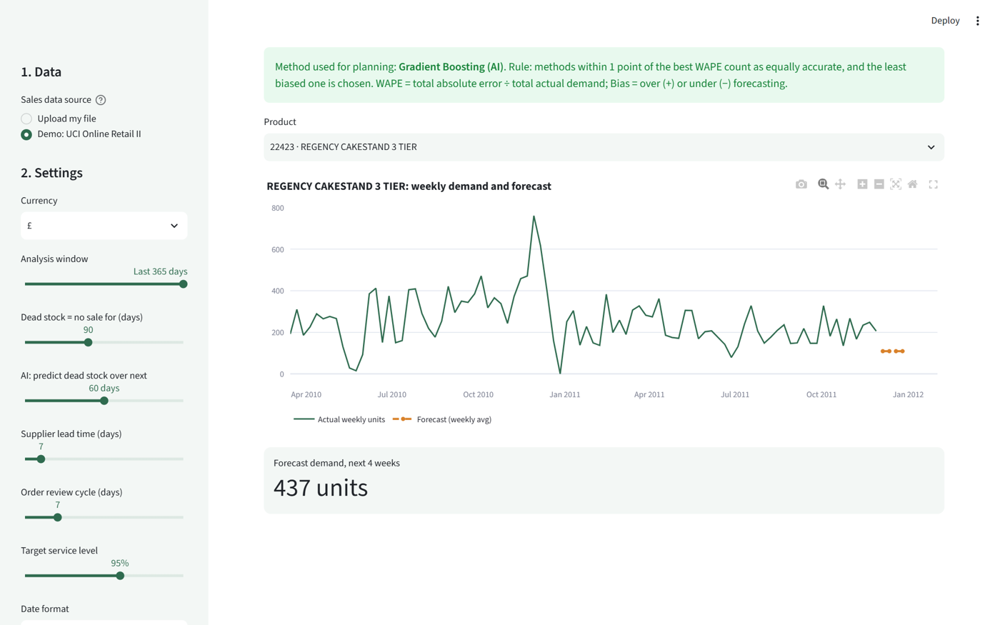
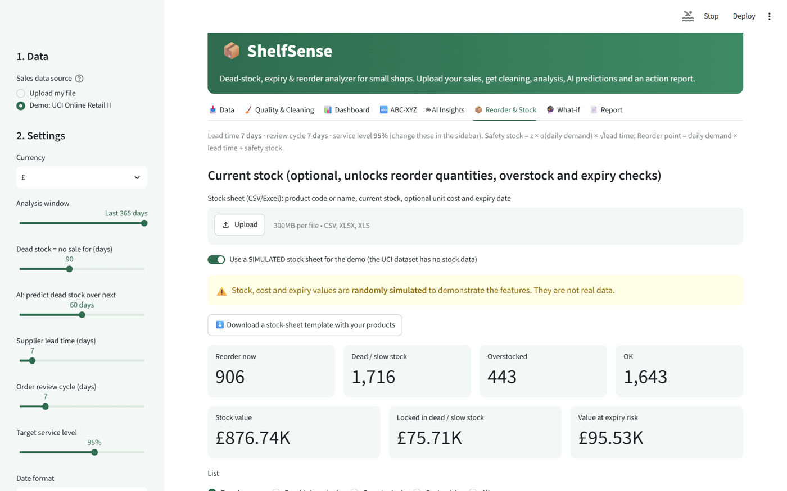
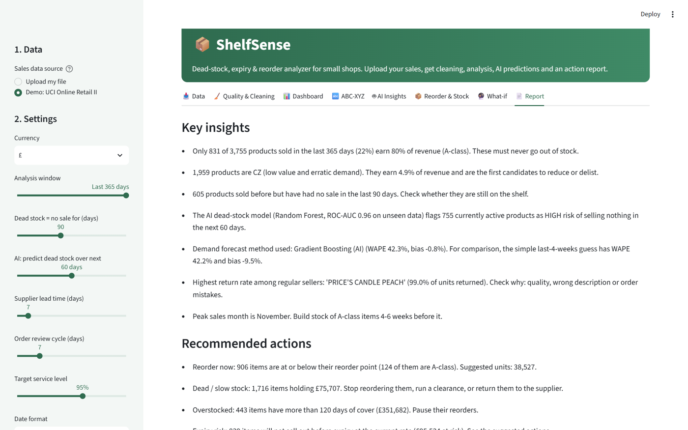

# 📦 ShelfSense
### Dead-Stock, Expiry & Reorder Analyzer for Small Shops

ShelfSense is an interactive data analytics and AI web app. A shopkeeper uploads their sales file (CSV or Excel), and ShelfSense:

- cleans the data and explains every fix,
- analyses sales,
- uses machine learning to predict **dead stock**, forecast **demand** and segment products,
- tells the shopkeeper **what to reorder, what to discount and what to stop stocking**,
- produces downloadable reports.

> Project for the **IBM SkillsBuild Data Analytics with AI Internship 2026** (BharatCares in association with AICTE) · Supports **UN SDG 12: Responsible Consumption and Production**



---

## Problem Statement

Kirana stores, pharmacies and small retailers lose money in three ways: stock that never sells (dead stock), stock that expires, and their best products running out. Big retailers have analytics teams to prevent this; small shops reorder by guesswork, even though their billing software already records every sale. ShelfSense turns those sales records into clear, explainable inventory decisions.

## Features

| Area | What ShelfSense does |
|---|---|
| 📥 **Any sales file** | Upload CSV/Excel. Columns are detected automatically (e.g. `Bill No`, `Item Name`, `Qty`, `Rate`) and can be corrected. Supports ₹/£/$/€ and DD/MM/YYYY dates. |
| 🧹 **Data quality & cleaning** | Reports issues first, then cleans with a full log of what was done and why: duplicates, returns/cancellations, fully cancelled orders, invalid prices, fee/postage lines, spelling variants and exceptional bulk orders. |
| 📊 **Dashboard** | KPIs, monthly revenue, top products, weekday × hour heatmap, top countries/branches, most-returned products. |
| 🔤 **ABC-XYZ analysis** | Which few products earn 80% of revenue (ABC), and how predictable their demand is (XYZ), with a stocking strategy for each class. |
| 🤖 **AI: dead-stock risk** | Random Forest / Logistic Regression predict which active products will sell **nothing** in the next 30/60/90 days. The models are tested on a later, unseen period and compared with a simple rule. |
| 🤖 **AI: demand forecast** | Gradient Boosting forecasts next-4-week demand per product and is compared against three baseline methods. |
| 🤖 **AI: product segments** | K-Means groups products into *Steady sellers, Seasonal, Occasional, Dormant*. |
| 📦 **Reorder & stock** | Safety stock, reorder point and order-up-to level. Upload a stock sheet to get **Reorder now / Dead stock / Overstocked / Expiry risk** lists with suggested actions. |
| 🔮 **What-if** | Change demand, lead time and service level and see the effect; clearance-sale cash calculator. |
| 📄 **Reports** | HTML report (can be printed to PDF), Excel workbook with all tables, cleaned CSV. |
| 🔒 **Privacy** | Runs 100% on your computer. No paid APIs, no cloud, no data leaves the machine. |

## Dataset

**Online Retail II**, UCI Machine Learning Repository (CC BY 4.0)
🔗 https://archive.ics.uci.edu/dataset/502/online+retail+ii

- 1,067,371 real transactions of a UK online giftware retailer, 01 Dec 2009 – 09 Dec 2011
- Columns: `Invoice, StockCode, Description, Quantity, InvoiceDate, Price, Customer ID, Country`
- It is used as the **demo dataset**. Any shop's own sales file can be uploaded instead.
- The dataset has no stock or expiry data. For the demo, the app offers a **clearly labelled simulated stock sheet** to show the stock features. Simulated values are never reported as results.

Citation: Chen, D. (2012). *Online Retail II* [Dataset]. UCI Machine Learning Repository. https://doi.org/10.24432/C5CG6D

## Technologies Used

Python 3 · pandas · NumPy · scikit-learn · Plotly · Streamlit · openpyxl

## Project Structure

```
ShelfSense/
├── VanshikaSolanki_ShelfSense.py        # complete project code (web app + command-line mode)
├── requirements.txt                     # Python libraries needed
├── README.md                            # this file
├── VanshikaSolanki_ProjectReport.docx   # project report
├── .streamlit/config.toml               # app theme and upload size
├── data/
│   └── README.md                        # where to put the dataset
├── screenshots/                         # images used in this README
└── outputs/                             # created when you run the command-line mode
```

## Setup

**Requirements:** Python 3.10 or newer (https://www.python.org/downloads/).

```bash
pip install -r requirements.txt
```

**Demo dataset (optional):** download `online+retail+ii.zip` from the UCI link above, unzip it and put `online_retail_II.xlsx` in the `data/` folder.

## How to Run

**Interactive web app** (opens in your browser at http://localhost:8501):

```bash
streamlit run VanshikaSolanki_ShelfSense.py
```

1. In the sidebar, choose **Upload my file** or **Demo: UCI Online Retail II**.
2. On the **Data** tab, check the column mapping and press **🚀 Clean & analyse**.
3. Explore the tabs: Quality & Cleaning → Dashboard → ABC-XYZ → AI Insights → Reorder & Stock → What-if → Report.

For the 1-million-row demo, the first analysis takes about 1.5–3 minutes. After that every tab responds instantly. Small shop files take a few seconds.

**Command-line mode** (runs the full analysis and saves `outputs/ShelfSense_Report.html`, `outputs/ShelfSense_Results.xlsx` and `outputs/results_summary.json`):

```bash
python VanshikaSolanki_ShelfSense.py
```

## Workflow

```
Upload → Column mapping → Quality check → Cleaning (logged) → Sales analysis & ABC-XYZ
       → AI: dead-stock risk · demand forecast · segments → Safety stock & reorder point
       → Reorder / discount / delist lists → What-if → HTML & Excel reports
```

## Results on the Demo Dataset

All figures below were produced by the project code.

**Data cleaning:** 1,067,371 raw rows became **996,940** clean sales lines. The cleaning log records:

- 34,337 duplicate lines removed
- 22,497 return/cancellation lines kept aside
- 6,335 fully cancelled orders removed
- 2,625 invalid prices removed
- 4,637 postage/fee lines removed
- 9,950 exceptional bulk orders capped for demand planning

**ABC analysis (last 365 days):** 831 of 3,755 products (22%) earn **80%** of revenue. 1,959 products are CZ (low value, erratic demand) and earn only 4.9%.

**Dead-stock prediction**: will an active product sell nothing in the next 60 days? Validated on an unseen period in which 24% of products actually went dead:

| Model | ROC-AUC | Precision | Recall | F1 |
|---|---|---|---|---|
| Rule: no sale in last 60 days | 0.954 | 0.785 | 0.831 | 0.807 |
| Logistic Regression | 0.950 | 0.655 | 0.922 | 0.766 |
| **Random Forest (selected)** | **0.960** | 0.722 | **0.913** | 0.806 |

**Demand forecast** (next 4 weeks per product, 3,021 products, tested on the last 8 weeks):

| Method | MAE (units) | WAPE % | Bias % |
|---|---|---|---|
| Naive: last 4 weeks | 75.91 | 42.17 | −9.51 |
| Moving average (12 weeks) | 85.11 | 47.27 | −18.55 |
| Seasonal naive: same weeks last year | 114.67 | 63.69 | +19.52 |
| **Gradient Boosting (AI, selected)** | 76.14 | 42.29 | **−0.79** |

Gradient Boosting and the naive method are equally accurate (WAPE within 0.12 points). Gradient Boosting is almost unbiased, while the naive method under-forecasts by 9.5%, which would cause stock-outs. The app's rule is: methods within 1 point of the best WAPE count as equal, and the least biased one is chosen.

**Product segments (K-Means, silhouette 0.364):** Steady sellers (1,820 products) earn 89.2% of revenue. Dormant/fading products (446) earn 0.5%.

## Key Insights

- About a fifth of the products earn 80% of revenue. These A-class items must never run out.
- 605 products sold before but have had no sale in the last 90 days. Check whether they are still on the shelf.
- The AI flags 755 active products as high risk of becoming dead stock in the next 60 days.
- Sales are strongly seasonal: they peak in November, so stock should be built 4–6 weeks earlier.
- Almost no trade happens on Saturdays. Most revenue comes on weekdays between 10:00 and 15:00.
- Recency is a very strong signal on its own. The AI adds value mainly by catching more at-risk products (recall 0.91 vs 0.83) and by removing forecast bias.

## Screenshots

| Cleaning log | ABC-XYZ |
|---|---|
|  |  |
| **AI: dead-stock risk** | **AI: demand forecast** |
|  |  |
| **Reorder & stock (simulated demo stock)** | **Report** |
|  |  |

## Limitations

- The demo data is from a UK giftware wholesaler, not an Indian kirana store.
- The demo dataset has no stock, cost or expiry data, so the stock features use a simulated sheet in the demo.
- Weekly product-level demand is noisy (WAPE ≈ 42%), so forecasts are combined with safety stock.
- The app analyses files. It is not connected live to billing or supplier systems.

## Future Scope

- Direct import from billing software (Tally, Vyapar) or Google Sheets
- Festival calendars (Diwali, Eid, Christmas) as forecast features
- Purchase-order generation and supplier lead-time tracking
- Multi-branch stock transfers; WhatsApp/SMS alerts
- Free online deployment on Streamlit Community Cloud

## Author

**Vanshika Solanki**, BCA, Sri Balaji University, Pune
IBM SkillsBuild Data Analytics with AI Internship 2026 · BharatCares × AICTE
